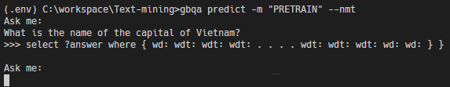

# GRAPH BASE QUESTION ANSWERING

**Subject:** Text Mining </br>
**Teacher:** PhD. Long Nguyen Hong Buu </br>
**Students:**
- Nguyen Vuong - 43.01.104.117
- Tam Luong - 43.01.104.157
- Duy Nguyen - 43.01.104.

---------
**Notebook:** [Google Colab](https://colab.research.google.com/drive/1TpKIKJFZp934D9OG75Mv6ex-Ihx9rFNN#scrollTo=Roa-GvnW87KJ)

---------
## **Introduction**
Graph Base Question Answer project for Text Mining class.
## **Requirements**

## **Installation**
You can download our source code at the [Github](https://github.com/haluwen9/gbqa) site or with the Git-cli:
```bash
git clone https://github.com/haluwen9/gbqa.git
```
Execute the following commands to install:
```bash
pip install -e gbqa
```
## **Command Line Manual**
```
gbqa --help # Show all commands
```
### **GBQA Model** `gbqa model [options] [options_args]`
**Options list**
- `-l, --lists`: Show all installed models.
- `-t, --train`: Not yet implemented. We recommend using our shared Notebook for training a new model.
- `-e, --evaluate`: Not yet implemented.
- `--template/-nmt`: Model type to use. There are two type available, *TEMPLATE_BASED* and *NMT*. **Default:** *TEMPLATE_BASED*
- `-p, --pretrain`: Download pre-trained model.
- `-i, --install`: Install your model.

**Example**
```bash
# Show all installed models
gbqa model --lists

# Train new Templated based model (Not yet implemented)
gbqa model --train "model-name" --template

# Train new Natural Machine Translation model (Not yet implemented)
gbqa model --train "model-name" --nmt

# Evaluate trained model (Not yet implemented)
gbqa model --evaluate "path_to_model/model-name_model-type.hdf5"

# Download pre-trained models
gbqa model --pretrain

# Install your trainned models
gbqa model --install "path_to_model/model-name" --template # For TEMPLATE_BASED MODEL
gbqa model --install "path_to_model/model-name" --nmt # For NMT MODEL

```
> ***Note:*** Model's name must follow this format: `[MODEL_NAME]_[MODEL_TYPE].hdf5`. For *NMT* models, MODEL_TYPE is NMT. For *TEMPLATE_BASED* models, you have to have 2 models which are Template Classificaiton model and Entity Recognition model, each of them have the following MODEL_TYPEs: TMP_CLS and TMP_REC.

---
### **GBQA Predict** `gbqa model [options] [options_args]`
**Options list**
- `--stdin/--file`: Predict from stdin or file. **Default:** stdin. *Support only stdin at the moment.
- `-m, --model`: Model name to use (without model type postfix). **Default:** PRETRAIN model.
- `--template/--nmt`: Model type to use. There are two type available, *TEMPLATE_BASED* and *NMT*. **Default:** *TEMPLATE_BASED*.

**Examples**
```bash
# Predicting Sparql using Pre-trained NMT Model
gbqa predict -m "PRETRAIN" --nmt

# Predicting Sparql using niceguys Template Based Model
gbqa predict -m "niceguys" --template
```


---
## **Demonstration Application**
Before running this program, you need to install requirement libraries using the following command:
```bash
cd demo
pip install -r requirements.txt
```
Running demo on *Windows*
```cmd
.\run-win.bat
```
On *Linux*
```bash
sudo chmod +x ./run.sh
./run.sh
```
After starting up, you can access the application with a browser from http://localhost:8080

> ***Note:*** This application uses pre-trained Template Based model. Make sure you have downloaded it with the command `gbqa model --pretrain`.
## **References**